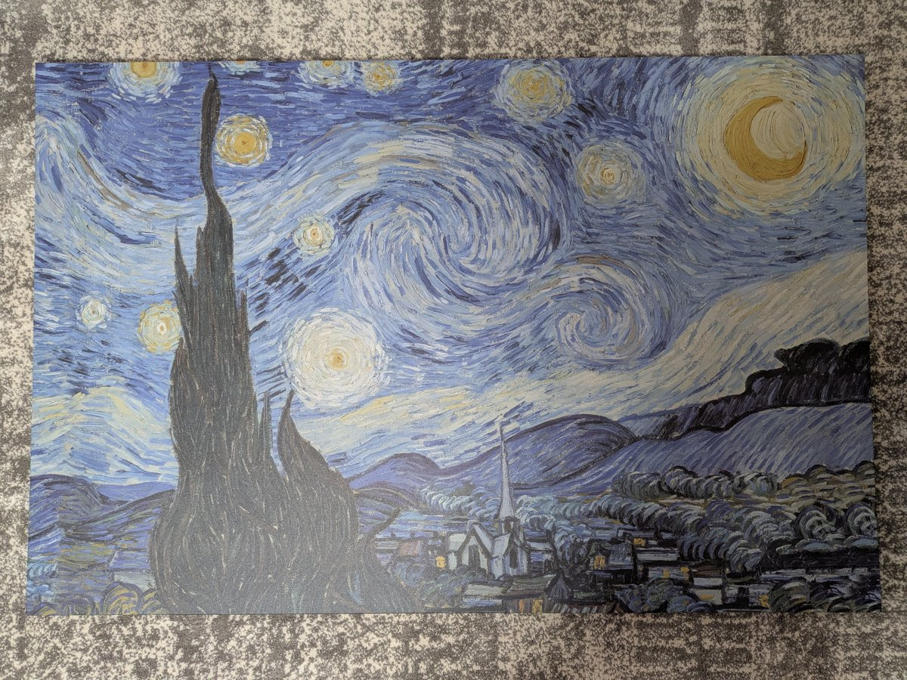
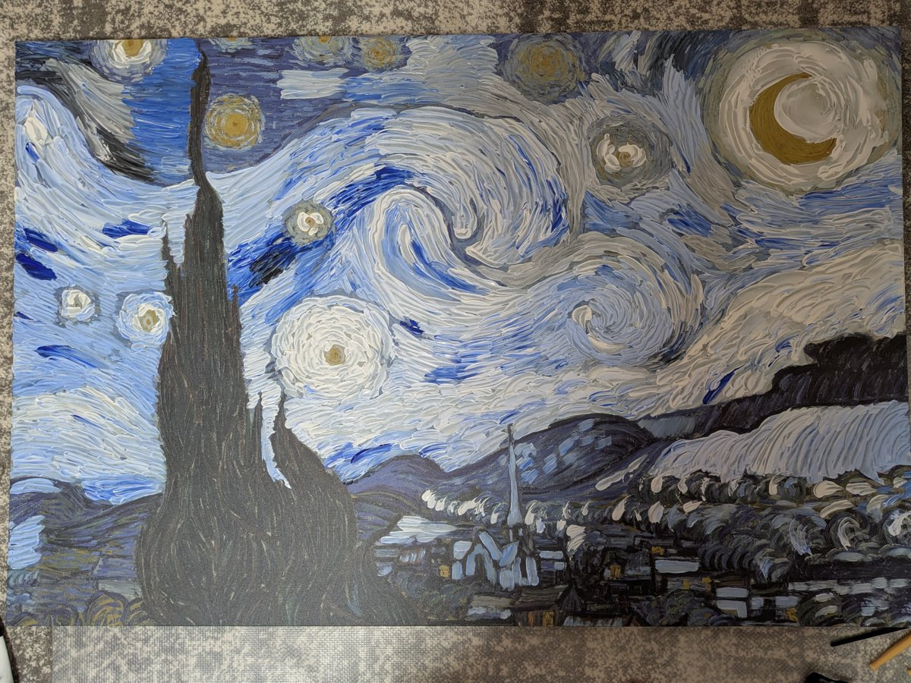
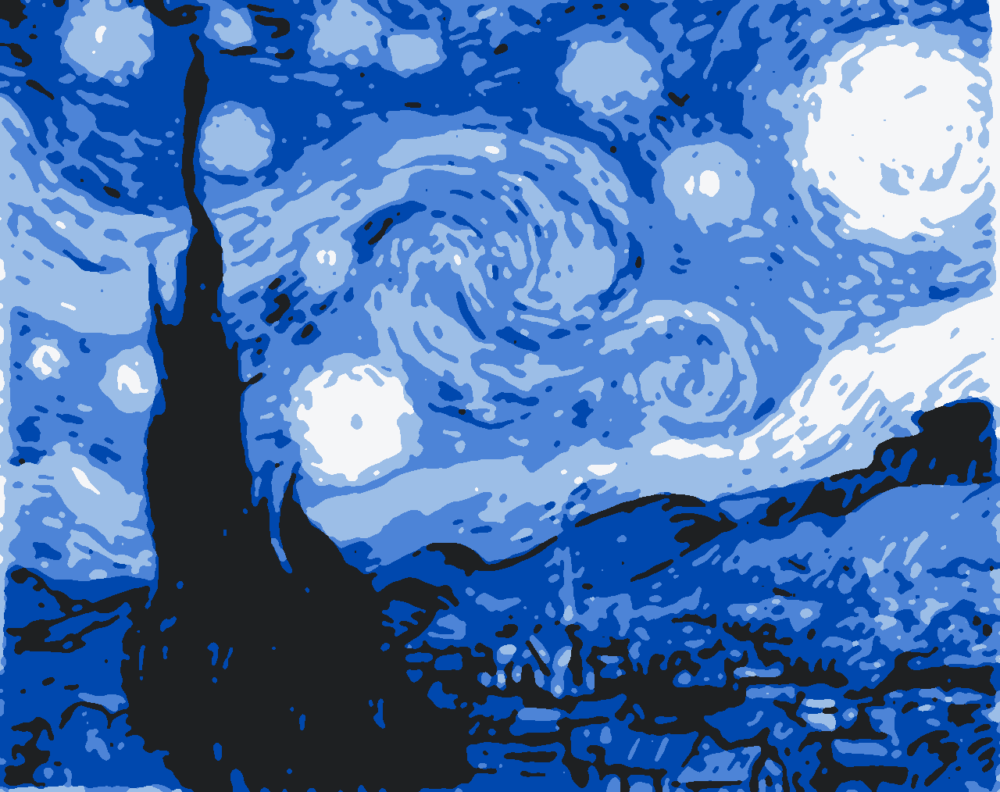
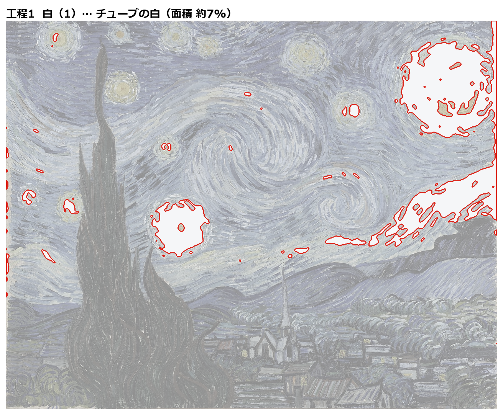
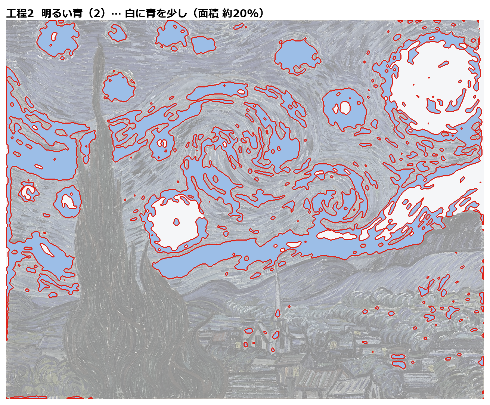
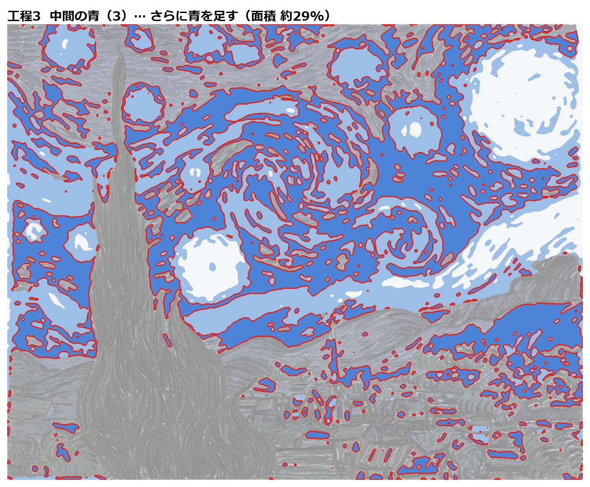
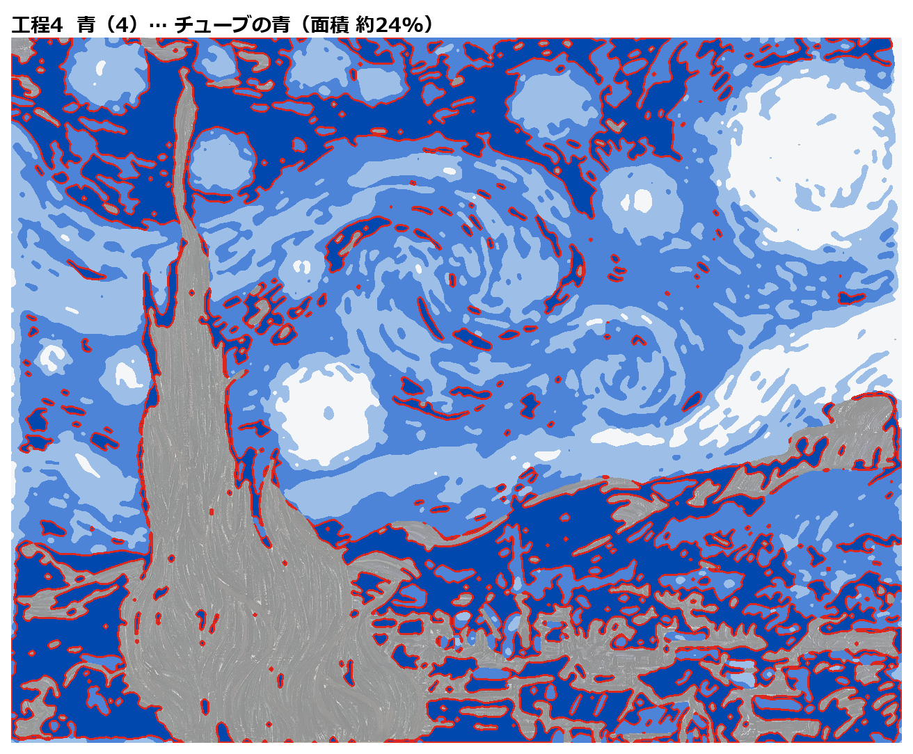
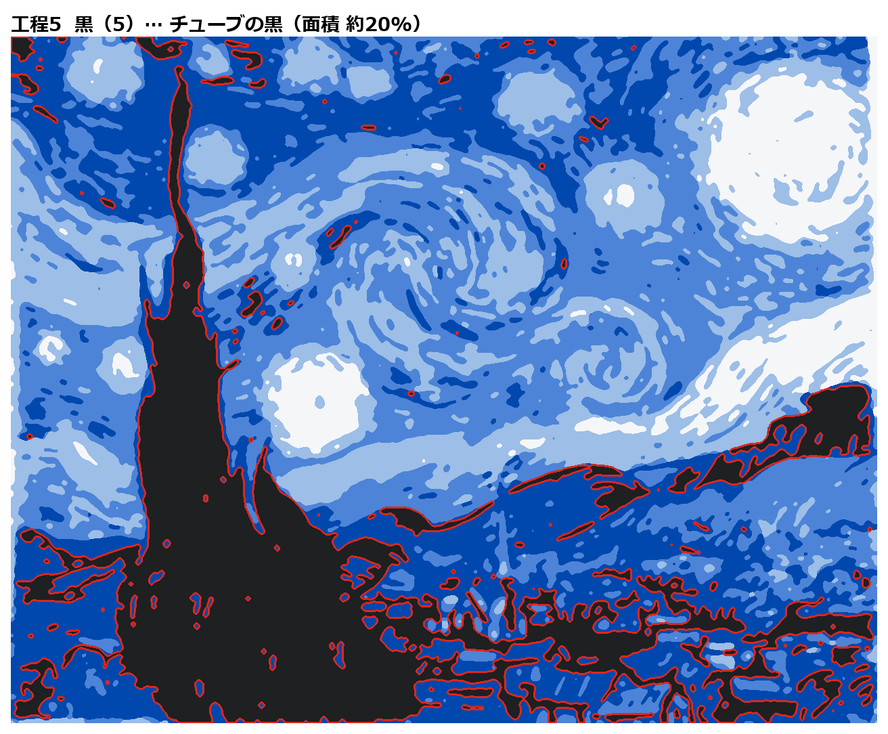

# 星月夜の上塗り — SynapseGit の活用事例

IKEA で買ったゴッホ「星月夜」のレプリカに、アクリルの**白・青・黒**を重ねて、
明度5段階の絵に描き替えていく制作の記録です。

AI（Claude Code）が明度の見本と工程ごとの地図を**提案**し、制作者（howlrs）がそれを見て塗り、
提案を**採用・不採用・保留**で判断します。どこまでが AI の提案で、どこからが人の判断なのかを、
[SynapseGit](https://github.com/howlrs/synapsegit) v1.0.0 で工程ごとに記録しています。

| 塗る前 | 工程1 白の後 | 最新（工程2・3と空の一部に黒） |
|---|---|---|
|  |  |  |

## SynapseGit で何を記録しているか

SynapseGit は、1件の記録に次の4つを残します。

| 枠 | この事例で入れたもの |
|---|---|
| Original（元の状態） | 絵の具を載せる前のレプリカの写真（全件共通） |
| Current（今の状態） | その工程を始める前の写真 |
| AI output（AI の提案） | その工程の地図（赤い輪郭がその工程で塗る場所） |
| Human Decision（人の判断） | 制作者がブラウザで選ぶ 採用／不採用／保留 |

制作者の絵の写真は AI output の枠に入れません。塗り終えた写真は、次の工程の Current になります。
SynapseGit が確かめられるのは「記録した画像のバイトが同じか」までで、作者や制作の事実を証明するものではありません。

## 記録の進み具合

| 件 | Current | AI の提案 | 判断 |
|---|---|---|---|
| 計画 `plan-blue-5values` |  |  | 判断待ち |
| 工程1 白 `step1-white` |  |  | 判断待ち |
| 工程2 明るい青 `step2-lightblue` |  |  | 判断待ち |
| 工程3 中間の青 `step3-midblue` |  ※ |  | 判断待ち |
| 工程4 青 `step4-blue` |  |  | 判断待ち |
| 工程5 黒 `step5-black` | 工程4の後に登録 |  | — |

※ 工程2と3は続けて塗り、その間の写真がありません。工程3の Current は工程2の開始前と同じ写真で、記録のメモにもそう書いています。

判断が済んだら、`synapse-present export --public --github` の書き出しを `synapsegit/` に置きます。

## このリポジトリの中身

| 場所 | 内容 |
|---|---|
| [`painting_steps.md`](painting_steps.md) | 白から順に暗くしていく塗り方の手順 |
| [`output/`](output/) | AI の提案。明度の見本（`03_value5_blue*.png`）と工程地図（`steps_blue/`、白黒版は `steps/`） |
| [`make_values.py`](make_values.py)・[`make_steps.py`](make_steps.py) | 見本と工程地図を作るスクリプト |
| [`photos/registered/`](photos/registered/) | SynapseGit に登録した写真（向きを直し、位置情報を含む EXIF を除いたもの） |
| [`RECORDING.md`](RECORDING.md) | 記録の方針、写真の一覧、登録の履歴 |
| [`progress.md`](progress.md)・[`review/`](review/) | 日ごとの進捗と添削、明度の比較 |
| [`docs/synapsegit-workflow.md`](docs/synapsegit-workflow.md) | 実際に使った SynapseGit のコマンドと、登録した画像の SHA-256 |

## GitHub に載せていないもの

- **SynapseGit の記録本体（`.synapsegit/`）**。repository・取り込み待ちの Inbox・生成メモ・ログ。
  SynapseGit の規約では、非公開の記録はアップロードせず、共有には公開用の書き出し（`synapse-present export --public`）を使います
- **受け取ったままの写真**。スマホの位置情報が入っているため。載せているのは EXIF を除いたコピーです
- **SynapseGit の実行ファイル**。SynapseGit は Source-Available License のため、使い方だけを載せています
